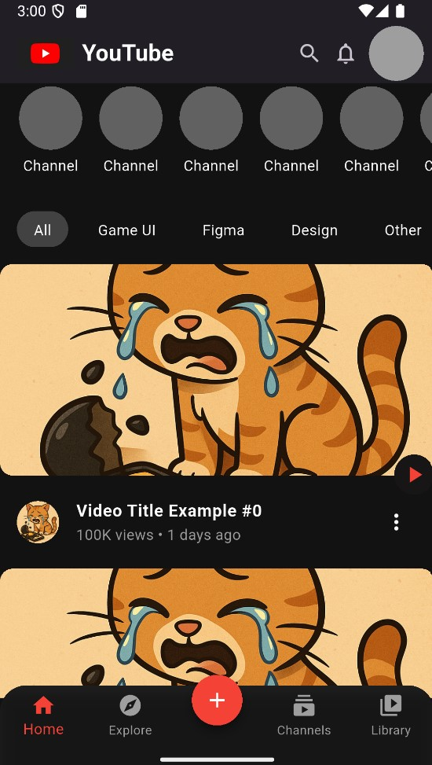
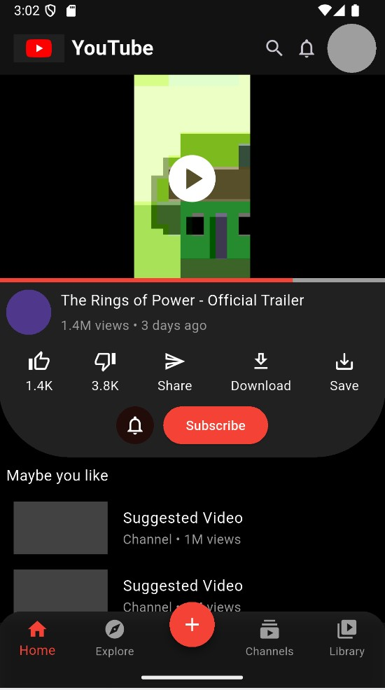
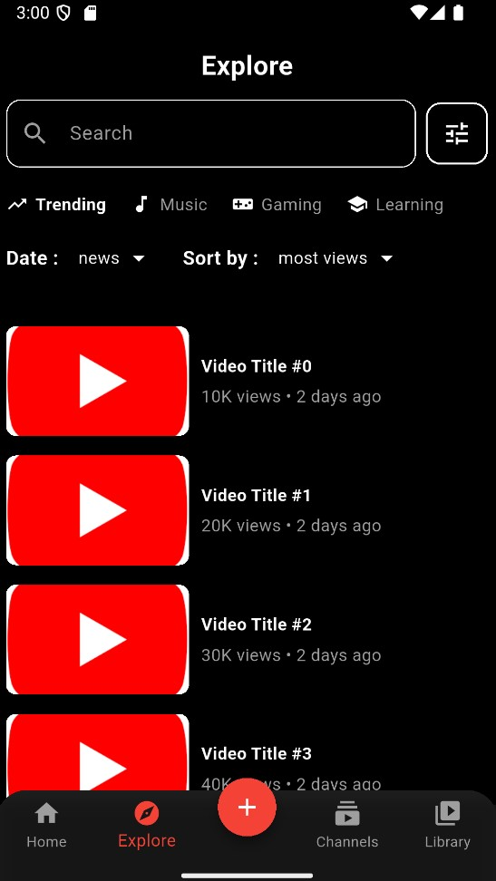
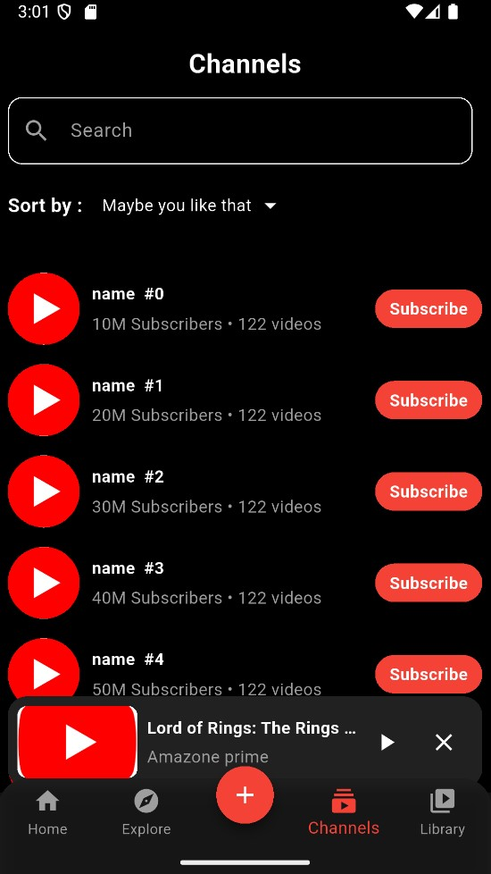

# Flutter Video Platform App (YouTube-like)

A Flutter application that allows users to upload and watch videos in a YouTube-like interface. The app provides a smooth and modern user experience, offering features similar to the real YouTube app.

---

## Features
- Easily upload videos.
- Play videos directly inside the app.
- Modern UI inspired by YouTube.
- Includes core features similar to YouTube.

---

## Screenshots
Here are some screenshots of the app:

  
  
  
  
